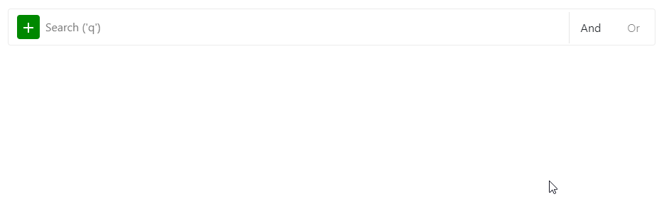

# React Filter (BETA)



Simple filter library to provide an efficient filter for lists as it is also used by

* Google Cloud
* Contentful
* ... any many more

## Features

* Autocompletion to add new filters.
* Easy to use with the keyboard.
* Based on custom filter model that defines which fields and operators are allowed.
* Support for custom value editors.

## Usage

### Step 0: Install React-filter

```
npm i react-complex-filter
```

### Step 1: Define your model

The model defines which fields are supported and which operators can be used with these fields. It is recommended to create the model in the backend and query it together with your list.

```
const Operators = [
    'eq',
    'ne',
    'lt'
];

const model = {
    operators: {
        eq: {
            label: 'equal'
        },
        ne: {
            label: 'not equal' // Optional label for the operator
        },
        empty: {
            isEmpty: true // No value is shown.
        }
    },
    fields: {
        string: {
            label: 'String',
            operators: Operators,
            component: StringValue
        },
        number: {
            label: 'Number',
            operators: Operators,
            component: StringValue
        },
        dateTime1: {
            label: 'DateTime',
            operators: Operators,
            component: DateValue
        },
        boolean1: {
            label: 'Boolean',
            operators: Operators,
            component: BooleanValue
        },
        enum: {
            label: 'Enum',
            operators: Operators,
            component: EnumValue,
            args: [{
                value: 'Option1',
                label: 'Option1'
            }, {
                value: 'Option2',
                label: 'Option2'
            }, {
                value: 'Option3',
                label: 'Option3'
            }, {
                value: 'OptionG_1',
                label: 'OptionG_1',
                group: 'G'
            }, {
                value: 'OptionG_2',
                label: 'OptionG_2',
                group: 'G'
            }]
        }
    }
};
```

### Step 2: Construct your query

The query is always a combination of a free search query and a logical filter.

```
const query = {
    query: 'My Query',
    logical: {
        logic: 'and',
        filters: [{
            field: 'string1',
            operator: 'eq'
        }, {
            field: 'number1',
            operator: 'eq'
        }, {
            field: 'enum',
            operator: 'eq'
        }]
    }
};
```

### Step 3: Use the component

```
const [query, setQuery] = React.useState(query);

<div id='portals'>
    <ComplexFilter filter={query} onChange={setQuery} model={model} />
</div>
```

The `portals` div is used to render dropdowns in front of your other components, independent from the positioning. Is is therefore recommend to add the div to your `index.html` file, after your actual app. For example

```
<div id="app"></div>
<div id="portals"></div>
```